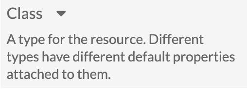

# Drawer

Drawers are containers than can be toggled to expand or collapse. The following example is a toggle for the description of a "Class" form field on the resource metadata form. It requires an anchor or button with "expand" or "collapse" for the `class`, the respective `aria-label`, and a `<div class="collapsible">` immediately after.



```
<div class="field-meta">
    <label for="resource-class-select">Class</label>
    <a href="#" class="expand" aria-label="Expand"></a>
    <div class="collapsible">
        <div class="field-description">A type for the resource. Different types have different default properties attached to them.</div>
    </div>
</div>
```