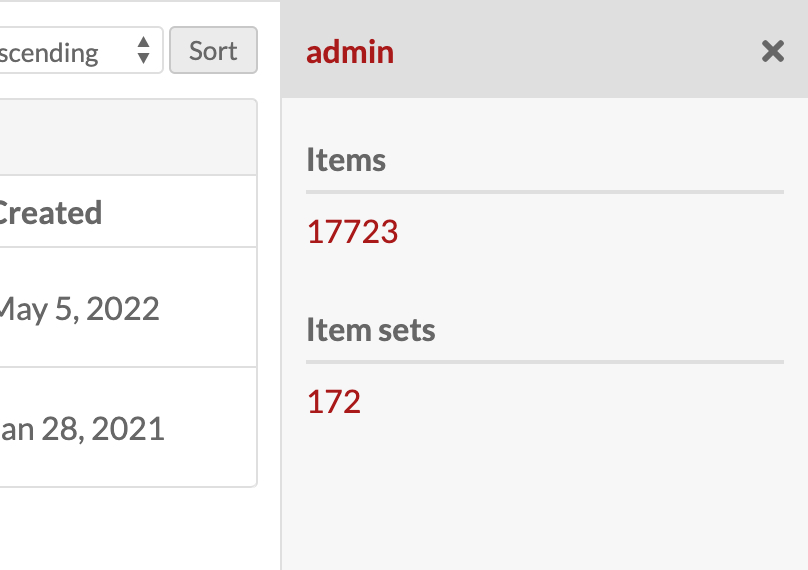

# Sidebar

Sidebars are content areas displayed alongside the main content.



## Button Activation

Sidebars can be activated by an anchor or button in the main content area. They require a few key attributes:

* `data-sidebar-selector`: the `id` attribute of the target sidebar
* `data-sidebar-content-url`: the url for the sidebar to populate it asyncronously

```
<a data-sidebar-selector="#sidebar" data-sidebar-content-url="/omeka-s/admin/item/54871/show-details" class="o-icon-more sidebar-content" title="Details" href="#" aria-label="Details"></a>
```

## Sidebar

The sidebar itself requires a unique `id`, "sidebar" for its `class`, and `active` if it is the visible sidebar on a page with multiple sidebars. It needs a close button or anchor, as well as a container for the sidebar's content.

```
<div id="sidebar" class="sidebar active">
    <a class="sidebar-close o-icon-close" title="Close" href="#" aria-label="Close"></a>    
    <div class="sidebar-content">
        <h3>Item Details</h3>
        ...    
    </div>
</div>
```